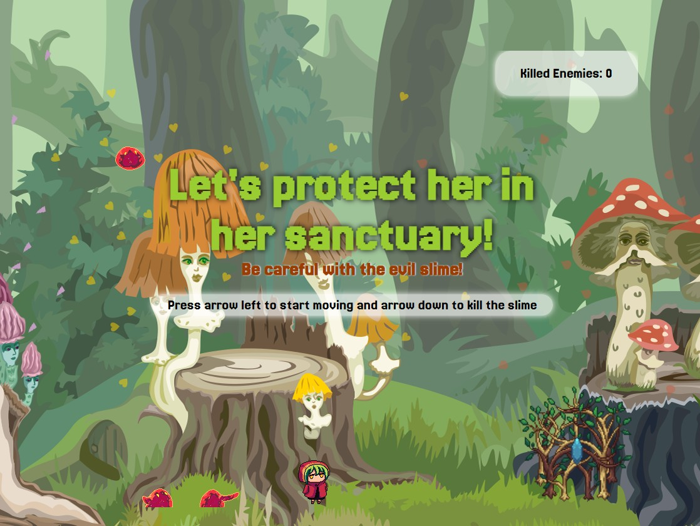

# Green Heart Guardian

## Description
Green Heart Guardian is a JavaScript-based game where the player must avoid falling slime while jumping on the floor and reaches her sanctuary. The slime moves randomly for about 8 seconds, creating a dynamic and unpredictable challenge. The game is built using JavaScript, HTML, and CSS.

## Instructions to Play
1. Open the game in your browser.
2. Use the **arrow keys** to move the player, jump and atack.
3. Jump to avoid the falling slime.
4. Survive as long as possible to achieve the highest score and run directly to the sanctuary to protect yourself!

*Important:* Ensure that your browser allows JavaScript to run for the best experience.

## Demo
[Play Green Heart Guardian](https://omleche.github.io/Greenheart-Guardian/)

## Resources
- [JavaScript Documentation](https://developer.mozilla.org/en-US/docs/Web/JavaScript)
- [HTML & CSS Basics](https://www.w3schools.com/)
- [Pixel Art by craftpix.net](https://craftpix.net/)
- [Sounds by Freesound.org](https://freesound.org/)
- [Ironhack Web Dev Program](https://www.ironhack.com/nl-en)
